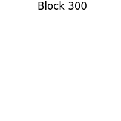
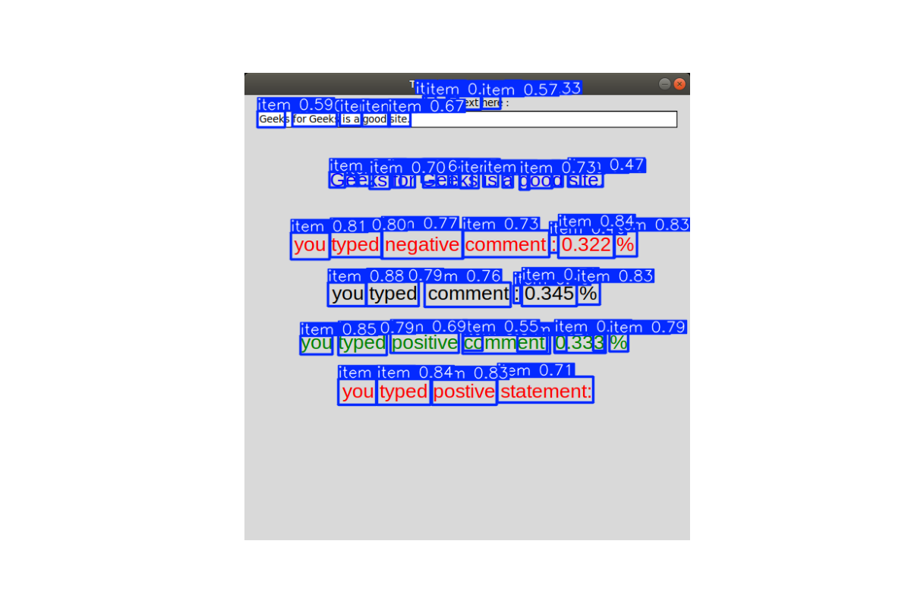
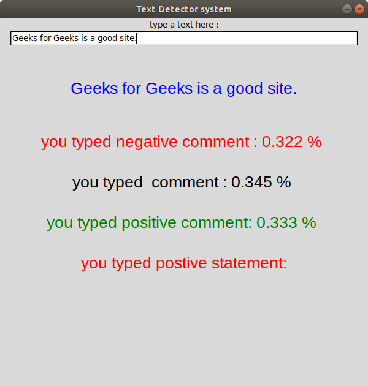

```markdown
# OCR

## Overview
**OCR** (Optical Character Recognition) is a Python-based project designed to detect and extract text from images. This repository contains scripts, datasets, pre-trained models, and example outputs to help users perform OCR tasks effectively.

---

## Features
- Text detection and recognition from images.
- Pre-trained model for English text (`eng.traineddata`).
- Scripts for testing, evaluation, and visualization.
- Sample datasets and images for quick testing.
- Jupyter notebooks for experimentation and model testing.

---

## Repository Structure
```
ocr/
├── datasets/                   # Contains datasets used for training/testing
├── attn_is_all_you_need.pdf    # Reference paper on attention mechanisms
├── check.py                    # Script for checking OCR functionality
├── check1.py                   # Additional script for testing OCR
├── eng.traineddata             # Pre-trained model data for English language
├── ground_truth.txt            # Ground truth data for evaluation
├── image.py                    # Script for image processing
├── no_optimization.py          # Baseline script without optimization
├── observed_output.txt         # Observed output from OCR tests
├── output.jpg                  # Example output image with detected text
├── reference.ipynb             # Jupyter notebook with reference implementation
├── requirement.txt             # List of required Python libraries
├── sample.py                   # Sample script demonstrating OCR usage
├── sample_page.jpg             # Sample input image for OCR
├── test_model.ipynb            # Jupyter notebook for model testing
├── text-detection-positive.png # Visualization of positive text detection
├── text_blocks.png             # Image showing detected text blocks
└── text_boxes.png              # Image showing bounding boxes around detected text
```

---

## Getting Started

### Prerequisites
- Python 3.x installed on your system.
- Install the required dependencies using the `requirement.txt` file:
  ```
  pip install -r requirement.txt
  ```

### Usage

1. **Run the Sample Script**  
   Perform OCR on a sample image (`sample_page.jpg`) using the `sample.py` script:
   ```
   python sample.py
   ```

2. **Test the Model**  
   Open the `test_model.ipynb` notebook to test the OCR model on custom inputs.

3. **Image Preprocessing**  
   Use the `image.py` script to preprocess images before performing OCR.

4. **Evaluate Performance**  
   Compare the observed output (`observed_output.txt`) with the ground truth (`ground_truth.txt`) to evaluate accuracy.

---

## Examples

### Detected Text Blocks:


### Bounding Boxes Around Text:


### Positive Detection Visualization:


---

## References
This repository includes the foundational paper on attention mechanisms:  
**[Attention Is All You Need](attn_is_all_you_need.pdf)**

---

## Contributing
We welcome contributions! If you'd like to contribute:
1. Fork this repository.
2. Create a new branch for your feature or bug fix.
3. Submit a pull request with a detailed description of your changes.

---

## License
This project does not currently specify a license. Please contact the repository owner for clarification regarding usage rights.

---

For any questions or issues, feel free to [open an issue](https://github.com/VStr20/ocr/issues).
```

---
Answer from Perplexity: pplx.ai/share
